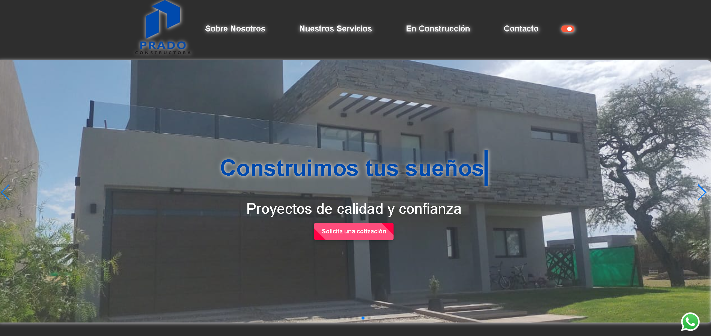

#  Prado Landing Page proyecto integrador

Este proyecto consiste en una landing page creada con HTML, CSS, JS siguiendo los conocimientos adquiridos levantamos el servidor en: https://pradoconstrucciones.netlify.app/. La landing page tiene como objetivo presentar los servicios de una entidad ficticia.

## Tecnologías
Estructura del Proyecto  
El proyecto está compuesto por los siguientes archivos:

- `index.html`: Contiene la estructura HTML de la landing page.
- `styles.css`: Contiene los estilos CSS para la presentación visual de la landing 
page.
- `script.js`: Contiene los eventos del SCRIPT del HTML de la landing page.
- `images`: Carpeta que contiene los iconos del favicon del HTML de la landing page.
- `mock`: Carpeta que contiene la imagen del mockup del HTML de la landing page.

Además, se incluyeron **Google Fonts** para personalizar la fuente y **Material Icons** para incorporar íconos como flechas y logos de redes sociales populares **Aos** para efectos de movimiento **Swiper** para un carrousel moderno.

<figure></figure>
